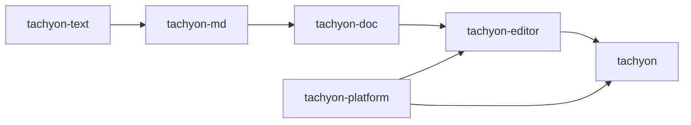
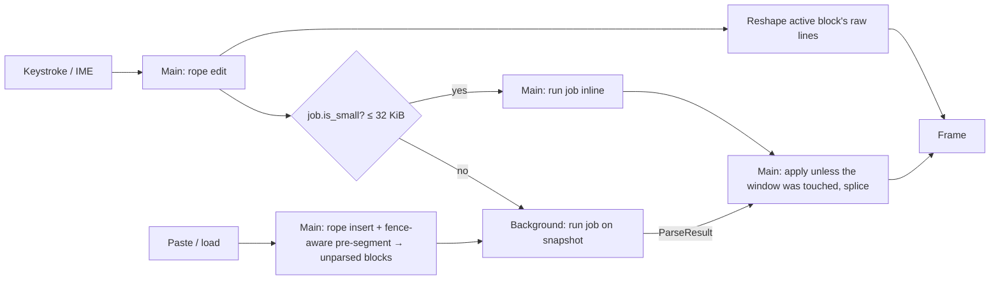

# Architecture

Tachyon is a single-pane, inline-WYSIWYG Markdown editor. It keeps a raw Markdown buffer as the
only source of truth and uses the **block-swap** model ([ADR 0002](adr/0002-block-swap-editing-model.md)):
the block containing the cursor renders as raw Markdown, every other block renders as rich text with
syntax hidden.

Block swap takes parsing off the keystroke path. The active block is shown raw, so drawing a
keystroke needs a rope edit and a reshape of that block's lines, never a parse result. Parsing
matters only when block boundaries change or the cursor leaves a block. The rest of the design
follows from that.

## Crates

Implemented: `tachyon`, `tachyon-platform`, `tachyon-text`, `tachyon-md`, `tachyon-doc`,
`tachyon-editor`, `xtask`. The theme lives in `tachyon-editor` (`theme.rs`) until themes become
user-configurable; a separate crate for one compiled-in theme would be ceremony. Its colors are
semantic tokens (surfaces, text, borders, accent, editing states, syntax) with compiled-in values
from the design direction (`docs/design/`); a unit test checks every documented contrast pair in
both themes, including text over the blended selection and find highlights. Empty placeholder
crates are not allowed.

| Crate | Status | Depends on GPUI | Responsibility |
|---|---|---|---|
| `tachyon` | exists | yes | Binary: CLI, single-instance claim, startup sequencing, windows |
| `tachyon-platform` | exists | no | OS integration GPUI lacks: single-instance IPC, autostart, DWM transitions and title-bar mode, the Linux system appearance at start-up (later: hotkey, backdrop) |
| `xtask` | exists | no | `ci`, `bench-startup` |
| `tachyon-text` | exists | **never** | Rope buffer, edit log, grouped undo, offset mapping, UTF-8↔UTF-16, line endings |
| `tachyon-md` | exists | **never** | `pulldown-cmark` wrapper → owned block IR with source maps; bare-URL autolinks and code highlighting as IR passes |
| `tachyon-doc` | exists | **never** | Document state, block map, incremental reparse, parse jobs |
| `tachyon-editor` | exists | yes | Editor view, block rendering, theme, input/IME, selection, clipboard |

GPUI dominates compile time. Keeping it out of the core crates keeps their tests in the seconds
range and means editing them never recompiles GPUI.

## State

GPUI entities and text shaping stay on the main thread. Background work receives an immutable
snapshot and returns owned data. The hot path has no shared `Mutex`.

**Buffer (`tachyon-text`).** A `ropey::Rope` (O(log n) edits, O(1) snapshot clones), a version
counter, a bounded edit log (`edits_since`) for rebasing stale background results, and undo
history. Undo groups are sealed explicitly by the editor (pauses, cursor jumps); the buffer holds
no clock or grouping policy. Line endings are normalized to LF on load and on insert, and the
dominant original ending is restored on save. IME and GPUI's input handler use UTF-16 ranges;
conversion goes byte → char → UTF-16 in O(log n).

**Block IR (`tachyon-md`).** `pulldown-cmark` events borrow the source `&str`, so each parse window
is copied out of the rope, parsed with `into_offset_iter()`, and converted to an owned IR with
**block-relative** offsets: visible text with syntax removed, one `LineInfo` per visible line (kind,
list depth and marker, quote depth), inline style runs, links, and a source map pairing visible
ranges with source ranges (click → source offset; cursor placement on swap). Block-relative
offsets mean an edit only changes the edited block's length; absolute positions are prefix sums.
Swap unit: leaf block (paragraph, list item, fence, table). Resync unit: top-level block.
Link reference definitions and footnotes are document-wide: a `DefTable` built from all blocks
resolves them (reference links through the broken-link callback, footnotes through a prefix of
definitions). Each block records the entry it found for every label it looked up, and is reparsed
only when the table now answers differently; a job that changes definitions parses its window
against the table as it will be, so pasted text does not come back block by block. The job that
will leave nothing dirty (the last chunk of a streamed paste) also rebuilds the whole table and
finds the blocks it makes stale, on its own thread; the owning thread installs the result if
nothing was edited since the job's snapshot, and otherwise rebuilds the table itself. The rules that
make every block parse identically alone and in context are in
[ADR 0005](adr/0005-incremental-reparse-by-block-windows.md).

**Document (`tachyon-doc`).** Buffer + `Arc<Vec<Block>>` with prefix sums (a sum tree only if
profiling asks for it) + sorted dirty ranges + at most one outstanding `ParseJob`. A job carries a
rope clone, the block list `Arc` and the table `Arc`; it is `Send` and runs anywhere. Its
`ParseResult` is applied back on the owning thread, or discarded if an edit touched its window.
Blocks keep a `BlockId` across reparses (untouched blocks, and any block that still starts at the
same offset); the editor gets `Splice`s describing each change to the block list.

**Render state (`tachyon-editor`).** GPUI's variable-height virtualized `list`, spliced from the
document's `Splice`s; items entering or leaving raw mode are remeasured. Visible blocks are rebuilt
each frame from their IR (GPUI caches shaped lines), so there is no separate layout cache yet. The
caret is a byte offset; the *active* block is the top-level block holding it. Inside lists,
quotes and footnotes only the active *leaf* (list item text, paragraph, code block; whole source
lines including markers, from `BlockIr::leaves`) renders raw and the rest of the container stays
rendered; other active blocks render raw entirely. Every other block renders its IR. Hit testing maps a click through the text layout to a
visible offset and through the block's source map to a document offset. The active block's text
layout from the last paint drives caret painting, vertical movement and IME candidate placement.
Scrolling follows the caret's line: a block off screen is scrolled to first, then the caret's line
is brought into view when it paints, so typing in a tall block never jumps to its top. While the
find bar is open, that reveal keeps the target below the bar's bottom edge (measured when the bar
prepaints, before any block paints), and the first block gets that much top padding so a match at
the very top can clear the bar. The document caret is not painted while the find bar or a picker
takes typing; the field there paints its own.
Selections are drawn as highlight backgrounds, so they span raw and rendered blocks alike.

## Plain-text mode

A `Document` has a `DocMode`: `Markdown` (block-swap, as above) or `Plain` (every block always
shows literal text - no syntax hiding, no block-swap distinction). `mode_for_extension` chooses by
the path's extension (`.md`, `.markdown`, `.mdown`, `.mkd`, `.mkdn`, `.mdx` → Markdown; anything
else, including no extension → Plain); `Ctrl+Shift+M` (`Editor::toggle_text_mode`) retags the same
buffer (text, undo and version untouched: `Document::retagged` only re-tiles it into blocks for
the new mode) rather than reloading, so the toggle is instant and undoable text stays undoable.
Toggling *to* Markdown is refused, with a notice, above `MARKDOWN_SIZE_LIMIT` (16 MiB, extrapolated
from Phase 2's 220 ms/10 MiB full-parse cost); a Markdown file that large opens as `Plain`
automatically with the same notice (`disk::load_document`), since nothing about that decision
needs a background path if it never has to run in the first place.

**Chunking.** A `Plain` document tiles into blocks of `PLAIN_CHUNK_LINES` (256) lines or
`PLAIN_CHUNK_BYTES` (16 KiB), whichever comes first, cut after a `\n` - except a line with no
`\n` within `PLAIN_FORCED_CUT_BYTES` (8 KiB) of its own start, which is cut there instead: a
display-only break (`next_plain_chunk_len`/`plain_chunk_lens`). The underlying bytes and the
block's reported line are unaffected; this only bounds how much of one pathologically long line
(a 20+ MB single line is the reported case this defends against) the virtualized list ever has to
shape or lay out at once. `Editor::vertical`'s fallback (`movement::vertical`, real source lines
via `rope.byte_to_line`) cannot see across such a cut - the whole multi-chunk line looks like line
0 throughout - so `cross_forced_cut` detects leaving a block that ends (or begins) without a `\n`
and continues into the neighboring block at the same byte offset from its start instead, before
falling back to `movement::vertical` for an ordinary line boundary.

That greedy packing runs once, at load (`plain_chunk_lens`) - it anchors every boundary to an
exact line/byte count from the start of the text, so it is never run again after an edit: shifting
the line count by anything that is not a multiple of 256 (typing `Enter` is the common case) would
move every boundary after it, turning a one-line edit into a splice of the whole document (a
1,000,000-line file cost ~487 ms for one keystroke, the regression this fixed). Instead, the
chunking invariant is local: a block ends at a line end or a forced cut as above, and is between a
minimum and a maximum size - at most `PLAIN_CHUNK_LINES`/`PLAIN_CHUNK_BYTES`, at least a quarter of
each (`PLAIN_MIN_CHUNK_LINES`/`PLAIN_MIN_CHUNK_BYTES`) unless it is the document's own last block
or immediately follows a forced cut, where a short remainder is expected. `Document::on_edit_plain`
restores it by touching only the block(s) the edit changed: it re-chunks their combined span with
`split_evenly` (even line-index splits, not greedy packing - the two ends of an existing span are
already constrained by whatever surrounds them, and a greedy pack's last, partial chunk cannot
promise to clear the minimum the way an even split can), and, if that span alone is too small to
stand on its own, first merges it with the next block (bounded by `PLAIN_MERGE_ATTEMPTS`, though
one merge is normally enough). Every other block keeps its exact length; an edit elsewhere only
moves its *absolute offset*, which the prefix-sum recompute after a splice handles without
touching content. A property test asserts the invariant (bounds, valid cut points, exact tiling)
after randomized edits, undo and redo of any size, and a separate test asserts that an edit
splices only a small, constant number of blocks regardless of document size, including `Enter`
near the top of a 1,000,000-line document.

Because every block in `Plain` mode renders raw (`render_block`'s `DocMode::Plain` arm), more than
one of them can paint in a frame - unlike Markdown, where only the active block ever does. Only
the block whose canvas paints a caret position (i.e. actually holds `head`) may write
`Editor::active_layout`: a later-painted neighbor with no caret in it must not silently steal it,
or `vertical` misdirects Up/Down using the wrong block's layout and bounds.

**Streaming load.** `Buffer::load` (`tachyon-text`) reads a file in 1 MiB chunks straight into a
`RopeBuilder`, never materializing the whole file as one `String` first (about half the peak
memory of `Buffer::new(&text)`); it normalizes line endings across chunk boundaries and replaces
invalid UTF-8 with U+FFFD, reporting `LoadReport { lossy, looks_binary }` (`looks_binary`: a NUL
byte in the first 8 KiB) instead of failing to open the file. `disk::load_document` is the single
place a path becomes a `Document`: it refuses outright (`LoadOutcome::Refused`, never reads) above
`PLAIN_HARD_LIMIT` (2 GiB - the measured ~4x-file-size peak RSS already puts that at 8+ GiB
resident), and forces `Plain` (no notice) for lossy or binary-sniffed content regardless of
extension. `Editor::lossy` records whether the file was decoded lossily; `Save`/`Save As` ask
"Save Anyway" or "Cancel" first when it is set (`confirm_lossy_then`), since writing would replace
the original bytes for good, and clear it once a save has gone through losslessly.

**Large documents off the UI thread.** Above `LARGE_PLAIN_SIZE` (64 MiB), the periodic
typing-pause backup is skipped (`Editor::schedule_backup`) - writing tens or hundreds of megabytes
1.5 s after every keystroke would itself compete for the UI thread's frame budget even though the
write runs off it - and the document is backed up only on quit or close instead (`backup_now`,
never gated by the size), so hot exit still restores it. Both that backup and an ordinary save
build the text to write (`tachyon_text::saved_text`: line-ending restoration, `O(document size)`)
inside the background task, from a cloned rope snapshot (`ropey`'s clone is O(1): nodes are
shared via `Arc`), not on the UI thread before handing it off. Find
(`Document::find_all`/`find_all_in_rope`) runs inline below `FIND_BACKGROUND_THRESHOLD` (5 MiB) and
on the background executor at or above it, with a generation counter so a result overtaken by a
newer search or an edit before it lands is dropped instead of clobbering fresher matches
(`find.rs`'s module doc comment has the full scheme); `FindState::searching` shows "searching…"
meanwhile, and actions that need current matches (`step_match`, `replace_current`, `replace_all`)
queue until a fresh scan lands rather than acting on a stale one.

## Concurrency

- **Reparse window.** Look-behind to the last blank line, the dirty blocks, one block of look-ahead. The
  window has converged when its last block equals the old block at that place (length, source hash,
  kind) or it reaches the end of the text; otherwise it grows geometrically. An unclosed fence grows
  it to the end, which is why large jobs go to the background.
- **Paste.** On Windows the clipboard is read on the background executor too
  (`tachyon_platform::clipboard_text_reader`, installed as the editor's `ClipboardReader`; GPUI's
  read on the UI thread took 11-12 ms for 5 MB). The clipboard is read once per paste, by
  whichever of the background task and the UI thread claims it first; two threads of the process
  inside the clipboard at once crashed (the UI thread's `CloseClipboard` freed text the other was
  still copying). Elsewhere GPUI reads it. A paste over 64 KiB is prepared on the background
  executor (`PreparedInsert`: line endings normalized, rope built, fence-aware pre-segmenting) and
  spliced into the buffer on the UI thread, O(log n). Plain text typed before it lands is queued
  and inserted right after it; other keystrokes and clicks that arrive first apply the paste
  synchronously (waiting for the read if the background task claimed it) so edits keep their
  order. The insert appears immediately as IR-free placeholder blocks of at least
  8 KiB (1 KiB within 32 KiB of either end, where the caret and so the first frame are), shown as
  raw source (only visible ones are shaped). A background job then parses the window; the job wraps
  its blocks in `Arc`s so applying the result on the UI thread is a merge and a splice. The faces
  the editor draws with are loaded right after the first frame, so a paste into a new scratch
  window does not pay for font loading. Large dirty ranges
  stream back in `PARSE_CHUNK` (128 KiB) windows, the caret's or viewport's first
  (`Document::parse_job_near`, ADR 0005), so the visible text is formatted after one chunk and a
  keystroke's reparse waits at most one chunk.
- **Executors.** GPUI's background and foreground executors only; no tokio. `Document` is
  executor-agnostic: the caller decides where each `ParseJob` runs.
- **Correctness invariant.** Property and corpus tests: after any sequence of edits, undo, streamed
  input and interleaved jobs, a clean document equals `tachyon_md::parse_document` of its text.

## Platform layer

GPUI provides windowing, rendering and text on every OS: Win32 + DirectX + DirectWrite on Windows,
Wayland/X11 + wgpu (Vulkan) + cosmic-text on Linux, Metal + CoreText on macOS. Tachyon does not add
a windowing layer. `tachyon-platform` covers the rest with one module per OS behind the same free
functions, selected at compile time.

**Single instance** ([ADR 0003](adr/0003-single-instance-ipc.md)). A second launch forwards its
arguments to the running instance and exits; if forwarding fails for any reason it starts
standalone rather than losing the launch.

- Windows: named pipe `\\.\pipe\tachyon-<session>-<user>`; the first creator
  (`FILE_FLAG_FIRST_PIPE_INSTANCE`) is primary, and a listening instance always exists while one
  client is served. The client calls `AllowSetForegroundWindow` so the primary may raise its window.
- Linux/macOS: an advisory lock on `tachyon.lock` elects the primary, which serves `tachyon.sock` in
  `$XDG_RUNTIME_DIR` (fallback: temp directory with the user name). The lock, not the socket, is
  authoritative, so a crashed primary's stale socket never blocks a new one.
- Wire format: `TACHYON2\n`, a `u32` LE body length, then NUL-terminated UTF-8 arguments (body
  capped at 1 MiB). The primary replies `OK` once it has accepted the launch; a secondary that gets
  no reply within its timeout starts standalone.

**Windows specifics.** Release builds use the GUI subsystem. The application manifest (PerMonitorV2
DPI, Windows 10+, segment heap, common controls v6) comes from GPUI: `gpui_platform` forces GPUI's
`windows-manifest` feature, so Tachyon must not embed a second `RT_MANIFEST`. The CRT is linked
statically and release shaders are precompiled with `fxc.exe`.

**Linux.** Without `WAYLAND_DISPLAY` or `DISPLAY` GPUI falls back to a headless platform whose
windows never render; Tachyon exits with an error instead (forwarding to a running instance still
works).

## Startup

The budget is launch to first frame, p95 < 50 ms ([ADR 0004](adr/0004-startup-budget-and-gate.md)).

1. Parse arguments (`lexopt`), claim the instance or forward and exit.
2. Start the GPUI application and open the window immediately. The themes are compiled in; the
   settings file (`settings.toml` in `tachyon_platform::config_dir()`, a few `key = value` lines)
   is read on a thread started before GPUI, and the first window waits at most 15 ms for it.
3. Files are read on the background executor and appear when ready; the clipboard is read
   synchronously (small).
4. Everything else (recent files, backups, spellcheck later) is read when first needed, off the UI
   thread where it can be.

`--startup-report` prints milestones measured from `main` (`platform_ready`, `window_open`,
`first_frame`); `cargo xtask bench-startup` also measures from `spawn`, which includes process
creation and loader time.

**Resident mode.** The primary keeps running after its last window closes, so a later launch only
pays for the hand-off and one window (about 30 ms on Linux instead of about 200 ms). It is the
default on Windows (`tachyon_platform::resident_by_default`); `--resident` / `--no-resident`
override it. GPUI runs with `QuitMode::Explicit`; the app quits when the last window closes unless
resident, and Quit (`Ctrl+Q`, `tachyon --quit` forwarded over the instance channel, or the tray
icon's menu) always ends the process after the windows have closed. Quit does not ask about
unsaved changes: the primary keeps a backup of every unsaved document and reopens them at its
next start (hot exit, [ADR 0006](adr/0006-hot-exit.md); `tachyon_editor::Backups`).
On Windows a resident primary shows a tray icon (`tachyon_platform::Tray`: a hidden window with
its own message loop on a `tray` thread, events forwarded to GPUI over a channel); clicking it
opens a window, and its context menu ("New window", "Quit Tachyon") is built from plain
`MF_STRING` items with real text, so screen readers and other UI Automation clients can read it
like any other menu (`SetForegroundWindow` before `TrackPopupMenuEx`, `PostMessage(WM_NULL)`
after: the documented pattern for a tray menu that keeps working, and closes, on repeated shows).
It also follows Tachyon's resolved theme, like the title bar below: `set_popup_menu_dark` records
the choice cheaply wherever a window or the settings resolve it, and the tray thread applies it
(`SetPreferredAppMode` / `FlushMenuThemes`, undocumented `uxtheme.dll` ordinals with no supported
alternative, Windows 10 1903+) right before the next `TrackPopupMenuEx`, since the preference is
per-thread and the menu shows on the tray's own thread. The icon
(`crates/tachyon-platform/assets/tachyon.ico`, generated from the brand
art in `assets/brand/` by `cargo xtask icons`) is embedded in the binary for the tray and set on every window at its DPI's
sizes; `crates/tachyon/build.rs` also writes it, with version information, as resources of the
executable (a `.res` file the MSVC linker takes directly, so no resource compiler is needed),
which Explorer, Task Manager and GPUI's window class use. `--background` starts a
resident primary without a window, and a second background start with nothing to open exits,
which makes it safe for login autostart; `--autostart on|off` registers or removes that start
(the current user's `Run` key on Windows, `$XDG_CONFIG_HOME/autostart/tachyon.desktop` on Linux).
Its state is the effective one: on Windows Task Manager's `StartupApproved` switch counts (turning
autostart on clears a "disabled" mark), on Linux a system entry in `$XDG_CONFIG_DIRS` counts unless
the user entry overrides it (turning autostart off then writes `Hidden=true`).
`--status` reports whether an instance runs (exit code 0 or 1) and whether autostart is on; it
claims the instance channel only for the check. Windows release builds are GUI-subsystem
executables, so these commands attach to the parent console to print. `TACHYON_INSTANCE_ID` renames the instance channel so
`cargo xtask bench-startup --warm` runs against a private resident instance
(`--report-launches` prints one line per forwarded launch once its window has drawn;
`--gap-ms` spaces the launches, 500 ms by default).

On Windows a resident instance keeps one **ready window**: created hidden 100 ms after each
launch's first frame (and at resident start), sized in advance, and filled with the launch's
document and shown when the next launch arrives. Creating a window there costs 40-60 ms and
showing a newly created one resizes its render targets; a ready window appears with its content
≈ 27 ms after the launch arrives (ADR 0004). `tachyon_platform::keeps_hidden_windows_hidden()`
gates it: Wayland maps windows opened hidden, so Linux has none. Ready windows have DWM's open
and close animations turned off (`disable_window_transitions`), so they appear, and draw, as soon
as they are shown. Every window's native title bar is set to Tachyon's resolved theme
(`set_title_bar_dark`, DWM's immersive dark mode) before it first paints, and again when the
theme changes (settings saved, or the system appearance with `theme = "system"`); the tray's
context menu is kept in step the same way (see above).

`TACHYON_FRAME_LOG=<path>` makes the editor append one line per frame to `<path>`: its busy time,
render time, editor work by kind (edit, clipboard, paste, parse), and each key's time from arrival
to the end of that frame's paint. Windows measurement runs use it to attribute slow frames.

## Packaging

`cargo xtask dist` packs the release binary with the README, changelog and licenses into a
`.zip` (Windows) or `.tar.gz` (elsewhere); `cargo xtask icons` renders `assets/brand`'s SVGs into
`crates/tachyon-platform/assets/tachyon.ico` and, for Windows, the MSIX tile and taskbar PNGs
under `packaging/msix/Assets` (both committed, like the `.ico`: no brand artwork is decoded at
runtime or build time from anything but these pre-rendered files).

**MSIX.** `packaging/msix/AppxManifest.xml` is a template (`{{VERSION}}` is the only
placeholder; `cargo xtask msix` fills in the workspace version as four parts, e.g. `0.1.0` →
`0.1.0.0`) that registers Tachyon as `Windows.FullTrustApplication`: an App Execution Alias
(`tachyon` works from any terminal, at a path stable across updates, unlike the versioned
`C:\Program Files\WindowsApps\...` install folder), file type associations for `.md` and
`.markdown`, and disabled file-system and registry write virtualization (the
`unvirtualizedResources` restricted capability) so settings (`%APPDATA%\Tachyon`), backups
(`%LOCALAPPDATA%\Tachyon`) and the autostart `Run` key land in the same real, global locations the
`.zip` build uses instead of a private per-package store. The manifest's `Publisher` must match
the Azure Trusted Signing certificate's subject exactly, or the package will not install.
`cargo xtask msix` (Windows only, needs `makeappx.exe` from the Windows 10/11 SDK) stages the
manifest, the signed `tachyon.exe` and `packaging/msix/Assets`, packs them, and writes
`Tachyon.appinstaller` pointing App Installer at the built MSIX. Because an MSIX install's real
path is versioned, `tachyon_platform::set_autostart` on Windows checks whether it is running
packaged (`GetCurrentPackageFullName`, only when `--autostart on` runs, never on the startup
path) and points the `Run` key at the execution alias instead of the exe it was given, so
autostart survives an update (`autostart_target` in `crates/tachyon-platform/src/windows.rs`,
unit-tested without touching the registry).

**Auto-update.** `Tachyon.appinstaller` uses App Installer's 2021 schema with
`HoursBetweenUpdateChecks="0"` and `AutomaticBackgroundTask`, so an install from a GitHub Release
checks for a newer MSIX on every launch and in the background. App Installer stages an update
but cannot swap a package whose process is still running; Windows has no supported way to force a
clean full-trust app to restart mid-update (`RegisterApplicationRestart` is for crashes and
reboots, not a voluntary exit), so a resident Tachyon's update applies the next time it fully
quits (tray icon "Quit Tachyon", or `tachyon --quit`) or at the next sign-in. Nothing in Tachyon
polls for this; it is documented behavior, not code, to keep the startup and resident paths
exactly as fast as they are today.

The release workflow (`.github/workflows/release.yml`) signs `tachyon.exe` and the MSIX with
Azure Trusted Signing (`Azure/trusted-signing-action`, pinned to a commit SHA) on the same
`windows-latest` leg that builds them, verifies both with `Get-AuthenticodeSignature`
(`.github/scripts/verify-signature.ps1`), and uploads the archives, the MSIX and the
`.appinstaller` to the GitHub Release alongside a `SHA256SUMS.txt`.

