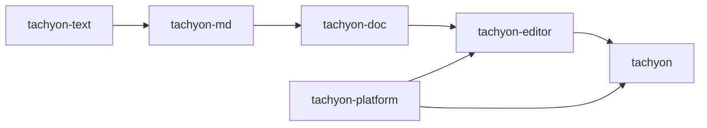
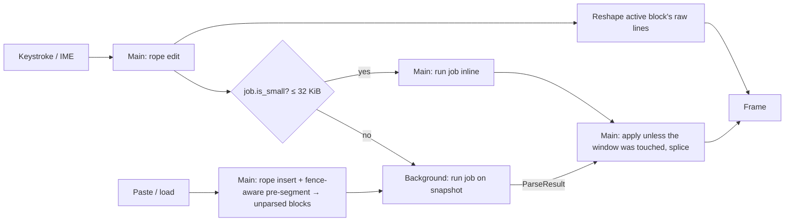

# Architecture

Tachyon is a single-pane, inline-WYSIWYG Markdown editor. It keeps a raw Markdown buffer as the
only source of truth and uses the **block-swap** model ([ADR 0002](adr/0002-block-swap-editing-model.md)):
the block containing the cursor renders as raw Markdown, every other block renders as rich text with
syntax hidden.

Block swap takes parsing off the keystroke path. The active block is shown raw, so drawing a
keystroke needs a rope edit and a reshape of that block's lines, never a parse result. Parsing
matters only when block boundaries change or the cursor leaves a block. The rest of the design
follows from that.

## Crates

Implemented: `tachyon`, `tachyon-platform`, `tachyon-text`, `tachyon-md`, `tachyon-doc`,
`tachyon-editor`, `xtask`. The theme lives in `tachyon-editor` (`theme.rs`) until themes become
user-configurable; a separate crate for one compiled-in theme would be ceremony. Empty placeholder
crates are not allowed.

| Crate | Status | Depends on GPUI | Responsibility |
|---|---|---|---|
| `tachyon` | exists | yes | Binary: CLI, single-instance claim, startup sequencing, windows |
| `tachyon-platform` | exists | no | OS integration GPUI lacks: single-instance IPC (later: hotkey, backdrop) |
| `xtask` | exists | no | `ci`, `bench-startup` |
| `tachyon-text` | exists | **never** | Rope buffer, edit log, grouped undo, offset mapping, UTF-8↔UTF-16, line endings |
| `tachyon-md` | exists | **never** | `pulldown-cmark` wrapper → owned block IR with source maps |
| `tachyon-doc` | exists | **never** | Document state, block map, incremental reparse, parse jobs |
| `tachyon-editor` | exists | yes | Editor view, block rendering, theme, input/IME, selection, clipboard |

GPUI dominates compile time. Keeping it out of the core crates keeps their tests in the seconds
range and means editing them never recompiles GPUI.

## State

GPUI entities and text shaping stay on the main thread. Background work receives an immutable
snapshot and returns owned data. The hot path has no shared `Mutex`.

**Buffer (`tachyon-text`).** A `ropey::Rope` (O(log n) edits, O(1) snapshot clones), a version
counter, a bounded edit log (`edits_since`) for rebasing stale background results, and undo
history. Undo groups are sealed explicitly by the editor (pauses, cursor jumps); the buffer holds
no clock or grouping policy. Line endings are normalized to LF on load and on insert, and the
dominant original ending is restored on save. IME and GPUI's input handler use UTF-16 ranges;
conversion goes byte → char → UTF-16 in O(log n).

**Block IR (`tachyon-md`).** `pulldown-cmark` events borrow the source `&str`, so each parse window
is copied out of the rope, parsed with `into_offset_iter()`, and converted to an owned IR with
**block-relative** offsets: visible text with syntax removed, one `LineInfo` per visible line (kind,
list depth and marker, quote depth), inline style runs, links, and a source map pairing visible
ranges with source ranges (click → source offset; cursor placement on swap). Block-relative
offsets mean an edit only changes the edited block's length; absolute positions are prefix sums.
Swap unit: leaf block (paragraph, list item, fence, table). Resync unit: top-level block.
Link reference definitions and footnotes are document-wide: a `DefTable` built from all blocks
resolves them (reference links through the broken-link callback, footnotes through a prefix of
definitions), and changing a definition invalidates the blocks that depend on it. The rules that
make every block parse identically alone and in context are in
[ADR 0005](adr/0005-incremental-reparse-by-block-windows.md).

**Document (`tachyon-doc`).** Buffer + `Arc<Vec<Block>>` with prefix sums (a sum tree only if
profiling asks for it) + sorted dirty ranges + at most one outstanding `ParseJob`. A job carries a
rope clone, the block list `Arc` and the table `Arc`; it is `Send` and runs anywhere. Its
`ParseResult` is applied back on the owning thread, or discarded if an edit touched its window.
Blocks keep a `BlockId` across reparses (untouched blocks, and any block that still starts at the
same offset); the editor gets `Splice`s describing each change to the block list.

**Render state (`tachyon-editor`).** GPUI's variable-height virtualized `list`, spliced from the
document's `Splice`s; items entering or leaving raw mode are remeasured. Visible blocks are rebuilt
each frame from their IR (GPUI caches shaped lines), so there is no separate layout cache yet. The
caret is a byte offset; the *active* block is the top-level block holding it. Inside lists,
quotes and footnotes only the active *leaf* (list item text, paragraph, code block; whole source
lines including markers, from `BlockIr::leaves`) renders raw and the rest of the container stays
rendered; other active blocks render raw entirely. Every other block renders its IR. Hit testing maps a click through the text layout to a
visible offset and through the block's source map to a document offset. The active block's text
layout from the last paint drives caret painting, vertical movement and IME candidate placement.
Scrolling follows the caret's line: a block off screen is scrolled to first, then the caret's line
is brought into view when it paints, so typing in a tall block never jumps to its top.
Selections are drawn as highlight backgrounds, so they span raw and rendered blocks alike.

## Concurrency

- **Reparse window.** Look-behind to the last blank line, the dirty blocks, one block of look-ahead. The
  window has converged when its last block equals the old block at that place (length, source hash,
  kind) or it reaches the end of the text; otherwise it grows geometrically. An unclosed fence grows
  it to the end, which is why large jobs go to the background.
- **Paste.** The rope insert and a fence-aware line scan happen in the same frame; an insert over
  64 KiB appears immediately as IR-free placeholder blocks of at least 8 KiB, shown as raw source
  (only visible ones are shaped). A background job then parses the window; the job wraps its blocks
  in `Arc`s so applying the result on the UI thread is a merge and a splice. Streaming chunked
  results back viewport-first is still open.
- **Executors.** GPUI's background and foreground executors only; no tokio. `Document` is
  executor-agnostic: the caller decides where each `ParseJob` runs.
- **Correctness invariant.** Property and corpus tests: after any sequence of edits, undo, streamed
  input and interleaved jobs, a clean document equals `tachyon_md::parse_document` of its text.

## Platform layer

GPUI provides windowing, rendering and text on every OS: Win32 + DirectX + DirectWrite on Windows,
Wayland/X11 + wgpu (Vulkan) + cosmic-text on Linux, Metal + CoreText on macOS. Tachyon does not add
a windowing layer. `tachyon-platform` covers the rest with one module per OS behind the same free
functions, selected at compile time.

**Single instance** ([ADR 0003](adr/0003-single-instance-ipc.md)). A second launch forwards its
arguments to the running instance and exits; if forwarding fails for any reason it starts
standalone rather than losing the launch.

- Windows: named pipe `\\.\pipe\tachyon-<session>-<user>`; the first creator
  (`FILE_FLAG_FIRST_PIPE_INSTANCE`) is primary, and a listening instance always exists while one
  client is served. The client calls `AllowSetForegroundWindow` so the primary may raise its window.
- Linux/macOS: an advisory lock on `tachyon.lock` elects the primary, which serves `tachyon.sock` in
  `$XDG_RUNTIME_DIR` (fallback: temp directory with the user name). The lock, not the socket, is
  authoritative, so a crashed primary's stale socket never blocks a new one.
- Wire format: `TACHYON2\n`, a `u32` LE body length, then NUL-terminated UTF-8 arguments (body
  capped at 1 MiB). The primary replies `OK` once it has accepted the launch; a secondary that gets
  no reply within its timeout starts standalone.

**Windows specifics.** Release builds use the GUI subsystem. The application manifest (PerMonitorV2
DPI, Windows 10+, segment heap, common controls v6) comes from GPUI: `gpui_platform` forces GPUI's
`windows-manifest` feature, so Tachyon must not embed a second `RT_MANIFEST`. The CRT is linked
statically and release shaders are precompiled with `fxc.exe`.

**Linux.** Without `WAYLAND_DISPLAY` or `DISPLAY` GPUI falls back to a headless platform whose
windows never render; Tachyon exits with an error instead (forwarding to a running instance still
works).

## Startup

The budget is launch to first frame, p95 < 50 ms ([ADR 0004](adr/0004-startup-budget-and-gate.md)).

1. Parse arguments (`lexopt`), claim the instance or forward and exit.
2. Start the GPUI application and open the window immediately. The theme is compiled in; there is
   no config I/O before the first frame.
3. Files are read on the background executor and appear when ready; the clipboard is read
   synchronously (small).
4. Everything else (config, recent files, grammars, spellcheck) runs after the first frame.

`--startup-report` prints milestones measured from `main` (`platform_ready`, `window_open`,
`first_frame`); `cargo xtask bench-startup` also measures from `spawn`, which includes process
creation and loader time.
