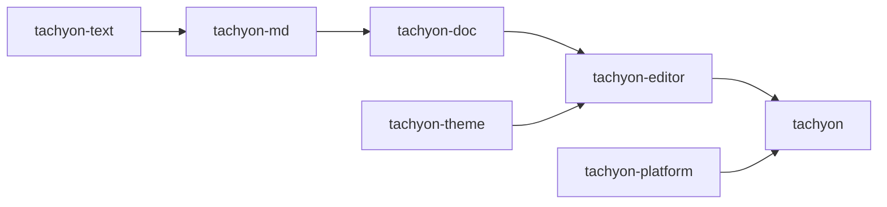
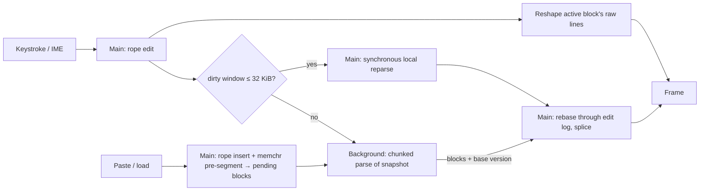

# Architecture

Tachyon is a single-pane, inline-WYSIWYG Markdown editor. It keeps a raw Markdown buffer as the
only source of truth and uses the **block-swap** model ([ADR 0002](adr/0002-block-swap-editing-model.md)):
the block containing the cursor renders as raw Markdown, every other block renders as rich text with
syntax hidden.

Block swap takes parsing off the keystroke path. The active block is shown raw, so drawing a
keystroke needs a rope edit and a reshape of that block's lines, never a parse result. Parsing
matters only when block boundaries change or the cursor leaves a block. The rest of the design
follows from that.

## Crates

Implemented today: `tachyon`, `tachyon-platform`, `tachyon-text`, `xtask`. The others arrive with the
phase that needs them ([ROADMAP](ROADMAP.md)); empty placeholder crates are not allowed.

| Crate | Status | Depends on GPUI | Responsibility |
|---|---|---|---|
| `tachyon` | exists | yes | Binary: CLI, single-instance claim, startup sequencing, windows |
| `tachyon-platform` | exists | no | OS integration GPUI lacks: single-instance IPC (later: hotkey, backdrop) |
| `xtask` | exists | no | `ci`, `bench-startup` |
| `tachyon-text` | exists | **never** | Rope buffer, edit log, grouped undo, offset mapping, UTF-8↔UTF-16, line endings |
| `tachyon-md` | Phase 2 | **never** | `pulldown-cmark` wrapper → owned block IR with source maps |
| `tachyon-doc` | Phase 2 | **never** | Document state, block map, incremental reparse, parse scheduling |
| `tachyon-theme` | Phase 3 | yes | Style tokens → GPUI text styles, built-in theme |
| `tachyon-editor` | Phase 3 | yes | Editor view, block elements, layout cache, input/IME, scrolling |

GPUI dominates compile time. Keeping it out of the core crates keeps their tests in the seconds
range and means editing them never recompiles GPUI.

## State

GPUI entities and text shaping stay on the main thread. Background work receives an immutable
snapshot and returns owned data. The hot path has no shared `Mutex`.

**Buffer (`tachyon-text`).** A `ropey::Rope` (O(log n) edits, O(1) snapshot clones), a version
counter, a bounded edit log (`edits_since`) for rebasing stale background results, and undo
history. Undo groups are sealed explicitly by the editor (pauses, cursor jumps); the buffer holds
no clock or grouping policy. Line endings are normalized to LF on load and on insert, and the
dominant original ending is restored on save. IME and GPUI's input handler use UTF-16 ranges;
conversion goes byte → char → UTF-16 in O(log n).

**Block IR (`tachyon-md`).** `pulldown-cmark` events borrow the source `&str`, so each parse window
is copied out of the rope, parsed with `into_offset_iter()`, and converted to an owned IR with
**block-relative** offsets: visible text, inline style runs, and a source map pairing visible
ranges with source ranges (click → source offset; cursor placement on swap). Block-relative
offsets mean an edit only changes the edited block's length; absolute positions are prefix sums.
Swap unit: leaf block (paragraph, list item, fence, table). Resync unit: top-level block. Link
reference definitions are global: a `RefDefs` table resolves them through
`Parser::new_with_broken_link_callback`, and changing a label invalidates the blocks that use it.

**Document (`tachyon-doc`).** Buffer + `Vec<Block>` with lazy prefix sums (a sum tree only if
profiling asks for it) + dirty ranges + a cancellation generation. `DocSnapshot` (rope clone,
version, `Arc<[Block]>`) is what crosses threads.

**Render state (`tachyon-editor`).** GPUI's variable-height virtualized `list`, spliced when the
block map changes; a layout cache keyed by block content hash, wrap width and theme revision;
estimated heights for off-screen blocks; a scroll anchor that pins the cursor's block on screen
when a swap changes its height.

## Concurrency

- **Reparse window.** Start from the dirty top-level blocks and parse. The window has converged
  when its last produced block ends at the window edge, is in a clean exit state (not inside a fence
  or HTML block), and lines up with an old block boundary. Otherwise add the next block and repeat.
  An unclosed fence grows the window to EOF, so that case goes to the background.
- **Paste.** The rope insert and a fence-aware line scan happen in the same frame; the pasted text
  appears immediately as pending plain blocks, and only visible ones are shaped. The background then
  parses ~64 KiB chunks, viewport first, and streams results back. Stale results are rebased through
  the edit log; blocks that overlap newer edits are marked dirty again.
- **Executors.** GPUI's background and foreground executors only; no tokio. Dropping a task cancels
  it; long jobs also check a generation counter between chunks.
- **Correctness invariant.** Property test: after any sequence of edits, incremental parse output
  equals a full parse of the final text.

## Platform layer

GPUI provides windowing, rendering and text on every OS: Win32 + DirectX + DirectWrite on Windows,
Wayland/X11 + wgpu (Vulkan) + cosmic-text on Linux, Metal + CoreText on macOS. Tachyon does not add
a windowing layer. `tachyon-platform` covers the rest with one module per OS behind the same free
functions, selected at compile time.

**Single instance** ([ADR 0003](adr/0003-single-instance-ipc.md)). A second launch forwards its
arguments to the running instance and exits; if forwarding fails for any reason it starts
standalone rather than losing the launch.

- Windows: named pipe `\\.\pipe\tachyon-<session>-<user>`; the first creator
  (`FILE_FLAG_FIRST_PIPE_INSTANCE`) is primary, and a listening instance always exists while one
  client is served. The client calls `AllowSetForegroundWindow` so the primary may raise its window.
- Linux/macOS: an advisory lock on `tachyon.lock` elects the primary, which serves `tachyon.sock` in
  `$XDG_RUNTIME_DIR` (fallback: temp directory with the user name). The lock, not the socket, is
  authoritative, so a crashed primary's stale socket never blocks a new one.
- Wire format: `TACHYON1\n` then NUL-terminated UTF-8 arguments, capped at 1 MiB.

**Windows specifics.** Release builds use the GUI subsystem. The application manifest (PerMonitorV2
DPI, Windows 10+, segment heap, common controls v6) comes from GPUI: `gpui_platform` forces GPUI's
`windows-manifest` feature, so Tachyon must not embed a second `RT_MANIFEST`. The CRT is linked
statically and release shaders are precompiled with `fxc.exe`.

**Linux.** Without `WAYLAND_DISPLAY` or `DISPLAY` GPUI falls back to a headless platform whose
windows never render; Tachyon exits with an error instead (forwarding to a running instance still
works).

## Startup

The budget is launch to first frame, p95 < 50 ms ([ADR 0004](adr/0004-startup-budget-and-gate.md)).

1. Parse arguments (`lexopt`), claim the instance or forward and exit.
2. Start the GPUI application and open the window immediately. The theme is compiled in; there is
   no config I/O before the first frame.
3. Files are read on the background executor and appear when ready; the clipboard is read
   synchronously (small).
4. Everything else (config, recent files, grammars, spellcheck) runs after the first frame.

`--startup-report` prints milestones measured from `main` (`platform_ready`, `window_open`,
`first_frame`); `cargo xtask bench-startup` also measures from `spawn`, which includes process
creation and loader time.
